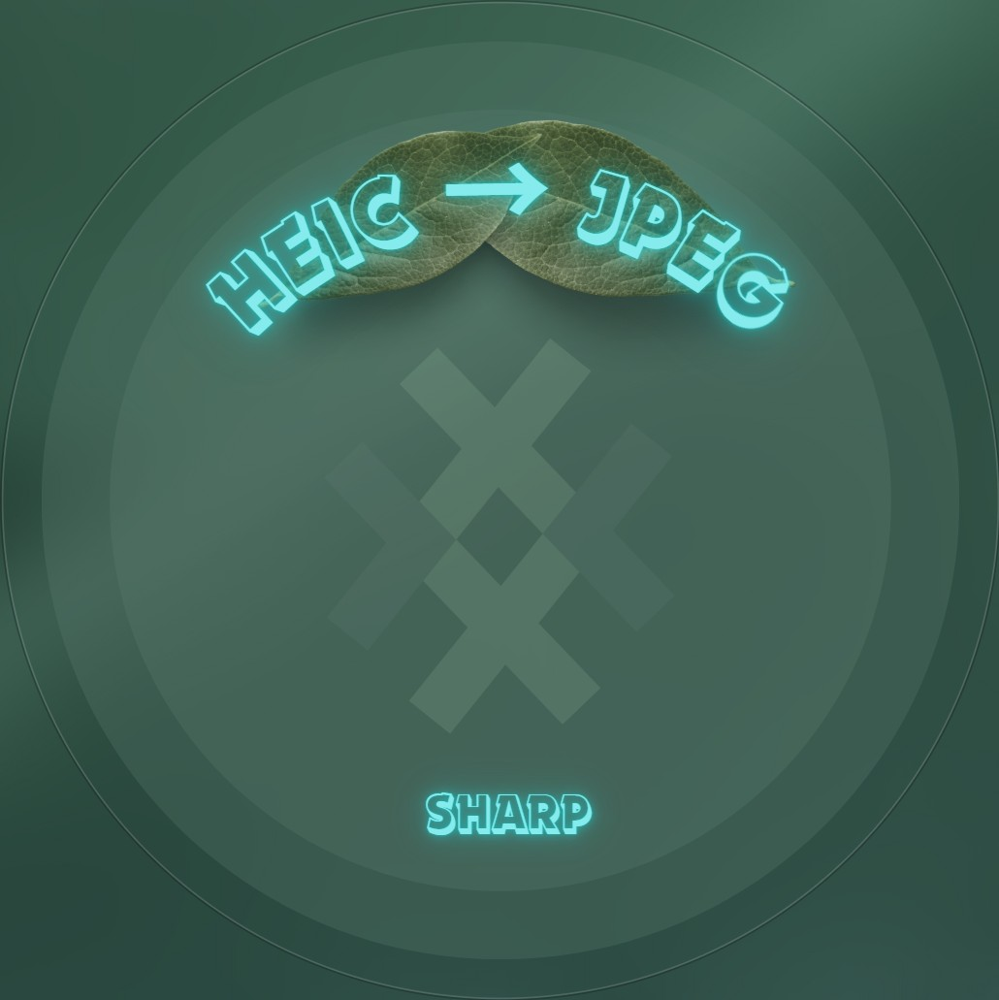

<p align="center">

</p>

# 🥦 Sharp-heic-utils
This repository is a utility that gives you the tools you need to convert a HEIC file with Sharp.

## 💥 Prerequisites

Before use this package, make sure you have the following tools installed on your machine:

* [**Node.js**](https://nodejs.org/en/download/package-manager/)
* [**Docker**](https://docs.docker.com/engine/install/)

## 🚀 Getting started

1. **Build the Docker image** ⤵️
```bash
# Alpine
$ docker build -f ./platforms/alpine/Dockerfile -t heic-convert .

# Debian
$ docker build -f ./platforms/debian/Dockerfile -t heic-convert .

# Ubuntu
$ docker build -f ./platforms/ubuntu/Dockerfile -t heic-convert .

# Windows
$ docker build -f ./platforms/windows/Dockerfile -t heic-convert .
```

2. **Start the container** ⤵️
```bash
$ docker run --rm -p 8800:8800 heic-convert
```

3. **Use the CLI** ⤵️  


In the other terminal and on the root of the project :
```bash
$ npm link
$ convert-heic ./test/file.heic
```

A JPG image should be added in the `test` folder 😁.

Enjoy 😊.